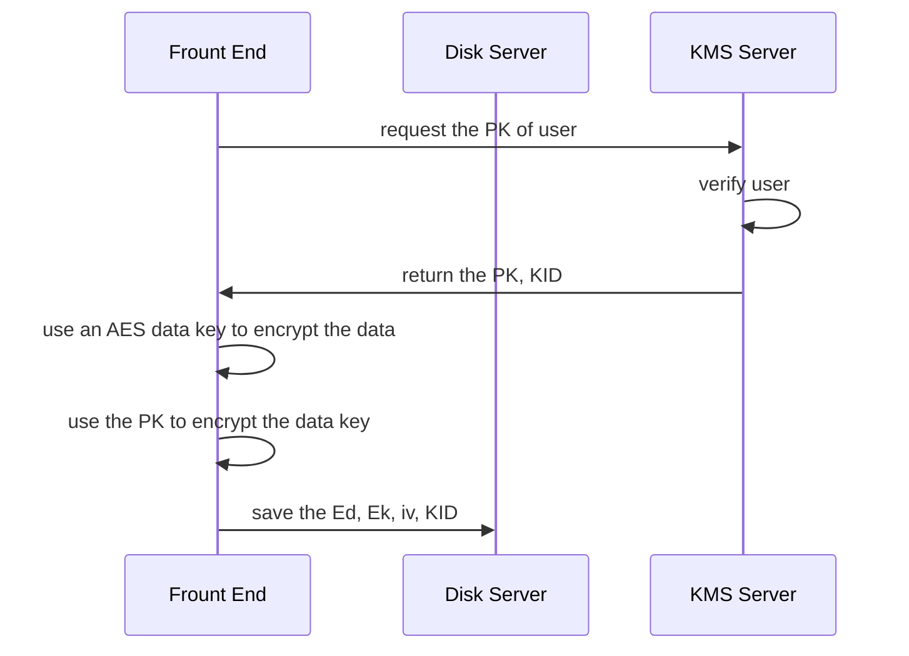
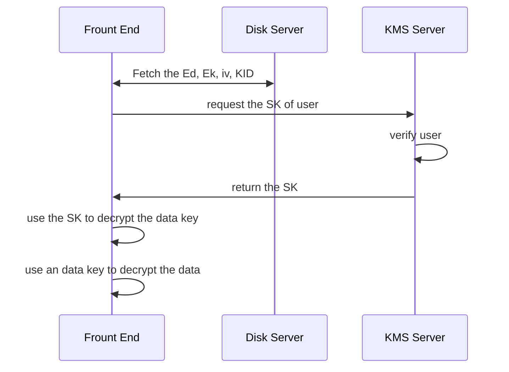
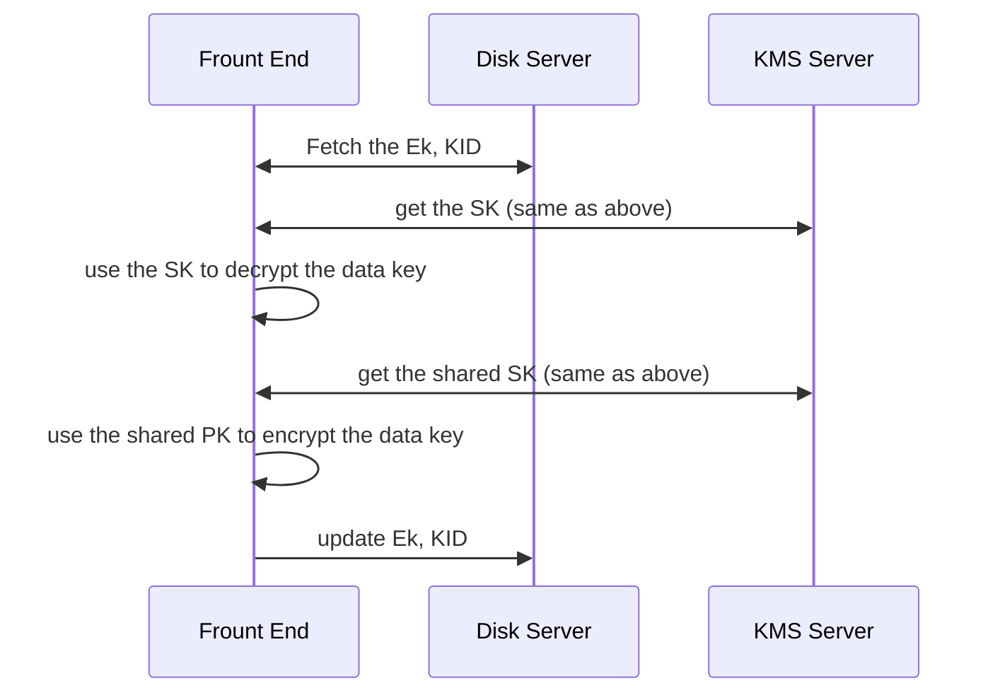

# 密碼工程 期末專案

這是一個加密雲端硬碟的小實作，有兩個組成部分：
- 儲存伺服器：負責儲存加密後的資料
- 金鑰管理伺服器 ( KMS )：負責管理金鑰的存取權限

為了解決雲端硬碟提供者可以查看所有人的資料的問題，所以需要將檔案在前端加密後，再上傳雲端，並且由獨立的 KMS 來管理金鑰權限。

專案依賴：[CEFP_KMS](https://github.com/nakiridaisuki/CEFP_KMS)\
前端開發：[CEFP_frontend](https://github.com/nakiridaisuki/CEFT_frontend)

## 使用方式

這個專案使用 [uv](https://docs.astral.sh/uv/) 來管理 python 環境
使用：
```
uv run app.py
```
來自動安裝依賴並執行主程式

## 主要功能
- 註冊、登入帳號
- 設定兩階段驗證
- 上傳、下載、刪除檔案
- 多人共用檔案

## 設計特點
- 修改檔案權限的操作時，只需要修改**檔案金鑰**的存取權限，而不用修改整份檔案，避免了大檔案重新加解密所需的時間
- 共用檔案時，只有檔案的所有人（也就是這份檔案的上傳者）有權共用或刪除該檔案，被共用者則只能下載。（當然如果他下載完重新上傳，我兩手一攤）

## 運作流程

代號：
PK: Public Key\
SK: Private Key\
KID: the ID of RSA key pair\
Ed: Encrypted data\
Ek: encrypted data key\
iv: AES's initialization vector\

### 上傳檔案


### 下載檔案


### 共用檔案
